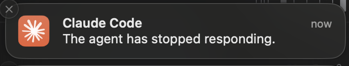

<a name="readme-top"></a>
[](https://github.com/Nat1anWasTaken/agent-notifications/graphs/contributors)
[](https://github.com/Nat1anWasTaken/agent-notifications/network/members)
[](https://github.com/Nat1anWasTaken/agent-notifications/stargazers)
[](https://github.com/Nat1anWasTaken/agent-notifications/issues)
[](https://github.com/Nat1anWasTaken/agent-notifications/blob/main/LICENSE)

<!-- PROJECT LOGO -->
<br />
<div align="center">
  <a href="https://github.com/Nat1anWasTaken/agent-notifications">
    
  </a>

<h3 align="center">Agent Notifications</h3>

  <p align="center">
    Desktop notifications for your coding agents.
    <br />
    <a href="https://github.com/Nat1anWasTaken/agent-notifications"><strong>Explore the docs »</strong></a>
    <br />
    <br />
    <a href="https://github.com/Nat1anWasTaken/agent-notifications">View Demo</a>
    ·
    <a href="https://github.com/Nat1anWasTaken/agent-notifications/issues">Report Bug</a>
    ·
    <a href="https://github.com/Nat1anWasTaken/agent-notifications/issues">Request Feature</a>

  </p>
</div>

<details>
<summary>Table of Contents</summary>

- [Agent Notifications (anot)](#agent-notifications-anot)
- [Features](#features)
- [Install](#install)
- [Quick Start (Claude Code)](#quick-start-claude-code)
  - [What the initializer does](#what-the-initializer-does)
- [Quick Start (Codex)](#quick-start-codex)
  - [What the initializer does (Codex)](#what-the-initializer-does-codex)
- [Manual Configuration (optional)](#manual-configuration-optional)
  - [Manual Configuration (Codex)](#manual-configuration-codex)
- [CLI](#cli)
- [Test Locally](#test-locally)
- [Configuration File](#configuration-file)
  - [Format](#format)
  - [Options](#options)
  - [Platform Notes](#platform-notes)
- [Uninstall / Remove Hooks](#uninstall--remove-hooks)
- [Notification Icons](#notification-icons)
- [Screenshot](#screenshot)
- [Troubleshooting](#troubleshooting)
- [License](#license)

</details>

# Agent Notifications (anot)

Desktop notifications for your coding agents.

Note: This is early-stage software. Expect rough edges.

## Features

- Agent hook integration (Claude Code and Codex; more agents planned)
- Notifications for multiple events (pre/post tool use, notifications, prompts, start/stop, etc.)
- macOS and Linux desktop support (via `notify-rust`)

## Install

- With Cargo

```bash
cargo install agent-notifications
```

- Or Build Locally

```bash
cargo install --path .
```

## Quick Start (Claude Code)

1. Run the initializer and follow prompts:

   ```
   anot init claude
   ```

   - Pick where to write hooks: `~/.claude/settings.json`, `.claude/settings.json`, or `.claude/settings.local.json`.
   - Select which events should trigger notifications.

2. You’re done. Claude Code will invoke `anot claude` for the selected events to show notifications.

### What the initializer does

It edits your chosen Claude Code settings file and adds hook entries that execute the `anot claude` command on selected events. Re-running the initializer updates/removes prior `anot` hooks and applies your latest selection.

## Quick Start (Codex)

1. Run the initializer and follow prompts:

   ```
   anot init codex
   ```

   - Pick where to write config: `$CODEX_HOME/config.toml`, `~/.codex/config.toml`, or provide a custom path.
   - If a `notify` command already exists, choose whether to override, keep, or remove it.

2. You’re done. Codex will invoke `anot codex` to show notifications when events fire.

### What the initializer does (Codex)

It sets the `notify` command in Codex’s `config.toml` to point to this tool, e.g.:

```toml
notify = ["/absolute/path/to/anot", "codex"]
```

## Manual Configuration (optional)

If you prefer to edit your settings file directly, add entries like this:

```json
{
  "hooks": {
    "Notification": [
      {
        "hooks": [
          {
            "type": "command",
            "command": "/absolute/path/to/anot claude",
            "timeout": 10
          }
        ]
      }
    ],
    "PreToolUse": [
      {
        "matcher": "*",
        "hooks": [
          {
            "type": "command",
            "command": "/absolute/path/to/anot claude",
            "timeout": 10
          }
        ]
      }
    ]
  }
}
```

Notes:

- `Notification`, `UserPromptSubmit`, `Stop`, `SubagentStop`, `PreCompact`, `SessionStart`, `SessionEnd` don’t require a `matcher`.
- `PreToolUse` and `PostToolUse` support `matcher` (exact, regex, `*`, or empty string).

### Manual Configuration (Codex)

In Codex’s `config.toml`, set `notify` to execute this tool:

```toml
notify = ["/absolute/path/to/anot", "codex"]
```

## CLI

- `anot` global options:

  - `--config <FILE>`, `-c <FILE>`: Path to `a-notifications.json` (default is under your system config dir, e.g., `~/.config/agent_notifications/a-notifications.json`).
  - `--reset-config`, `-r`: Recreate default config file if it exists.
  - `--debug`, `-d`: Increase debug level (repeatable).

- Commands:
  - `anot init claude [<path-to-settings.json>]`: Interactive setup for Claude Code hooks. If no path is provided, you’ll be prompted to choose.
  - `anot claude`: Processes a Claude Code hook event from stdin and emits JSON hook output. Used by the hooks you configure.
  - `anot init codex`: Interactive setup for Codex `notify` in `config.toml`. If no path is provided, you’ll be prompted to choose.
  - `anot codex [<notification-json>]`: Processes a Codex notification payload. Used by the hooks you configure.

View help: `anot --help`, `anot init --help`

## Test Locally

You can simulate a Claude Code hook by piping JSON into `anot claude`:

```bash
echo '{
  "session_id": "abc123",
  "transcript_path": "/path/to/transcript.jsonl",
  "hook_event_name": "Notification",
  "message": "Hello from anot"
}' | anot claude
```

Expected:

- A desktop notification appears.
- The tool writes a JSON response to stdout (suppressed by Claude Code in normal operation).

You can also simulate a Codex notification:

```bash
echo '{
  "type": "agent-turn-complete",
  "turn-id": "abc123",
  "input-messages": ["Run tests"],
  "last-assistant-message": "All tests passed"
}' | anot codex
```

## Configuration File

`anot` keeps its own config at:

- Default: `~/.config/agent_notifications/a-notifications.json` (created on first run)
- Override with `--config <FILE>`
- Reset with `--reset-config`

### Format

```json
{
  "version": 1,
  "claude": { "pretend": true },
  "codex": { "pretend": false }
}
```

### Options

- `version`: Internal schema version. Leave as `1`.
- `claude.pretend` (macOS only): When `true`, `anot` pretends to be the Claude app for notifications so the left-side app icon shows as Claude. When `false`, the notification uses the Terminal app identity and shows the Claude icon as the content image on the right.
- `codex.pretend` (macOS only): When `true`, `anot` attempts to pretend to be the ChatGPT app for notifications. The ChatGPT app appears to enforce stricter checks, so pretending is unreliable. It’s recommended to keep this `false` so the Codex/ChatGPT icon is shown as the content image instead.

Defaults are `claude.pretend = true`, `codex.pretend = false`.

### Platform Notes

- macOS: Pretend mode controls whether the notification uses the target app’s bundle (left-side icon) vs. Terminal + a content image. If the target app isn’t installed or pretend is disabled, you’ll see the Terminal app on the left and the agent icon as the content image.
- Linux/BSD: Pretend is ignored; the agent icon is shown via the notification daemon.
- Windows: Not currently implemented.

## Uninstall / Remove Hooks

- Run `anot init claude` and deselect all events to remove existing `anot` hooks from the chosen settings file.
- Or manually delete the relevant entries in your Claude Code settings.

For Codex, run `anot init codex` and choose “Remove the notify configuration” to clear the `notify` entry, or edit your `config.toml` and remove the `notify` line.

## Notification Icons

Icon behavior differs by platform:

- **macOS**: The app icon (left side of the notification) is only available when Claude Desktop is installed because macOS requires a signed app bundle to supply the notification’s application icon. If Claude Desktop is present, notifications use the Claude app’s icon. If not, macOS shows the Terminal icon on the left and uses the agent image as the content image (right side of the notification). Install Claude Desktop: https://claude.ai/download
- **Unix (Linux/BSD)**: Icons are supported out of the box. The agent icon is displayed without requiring an app bundle, assuming a desktop notification daemon is running.
- **Windows**: Icon support is not implemented yet.

## Screenshot



## Troubleshooting

- No notifications on Linux: ensure a desktop notification daemon is running (DBus notifications) and your environment supports it.
- No notifications on macOS: check Notification Center permissions for your terminal.
- Nothing happens: re-run `anot init claude` and confirm hooks are added to the expected settings file.
- Paths: the hook command must be an absolute path to `anot`.

## License

GPL-3.0-or-later. See `LICENSE`.
